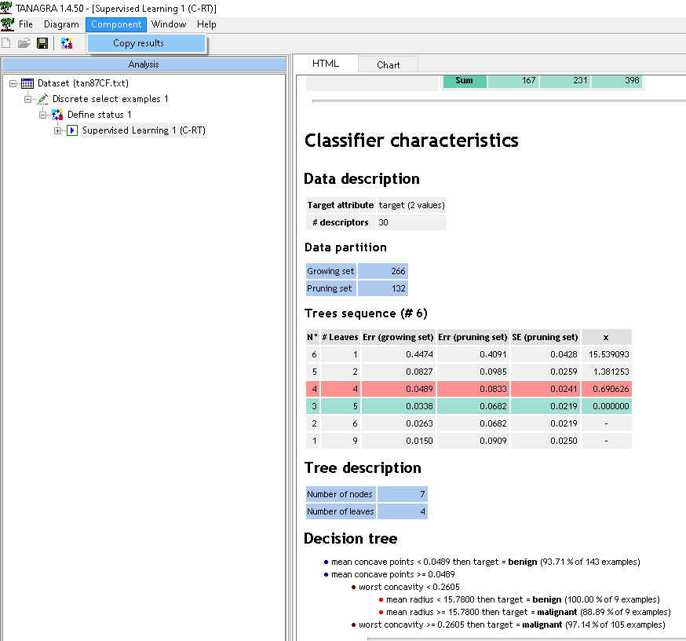
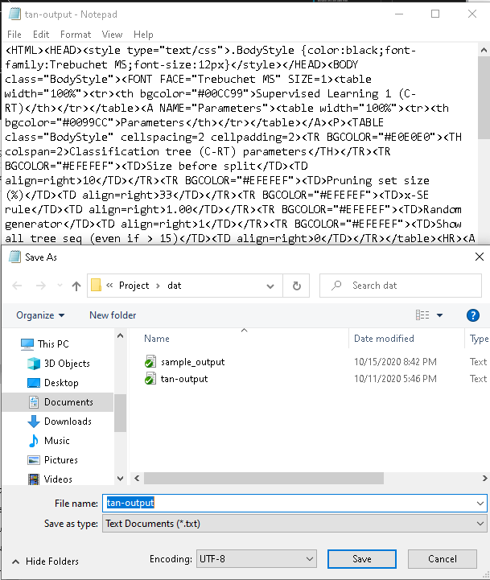

# Tanagra Parser
**tana2tree** is a Python module for converting a Tanagra tree description into a more usable format. 

Tanagra is a free suite of machine learning software for research and academic purposes developed by Ricco Rakotomalala at the Lumière University Lyon 2, France. Tanagra supports several standard data mining tasks such as Visualization, Descriptive statistics, Instance selection, feature selection, feature construction, regression, factor analysis, clustering, classification and association rule learning. 

Click [here](http://eric.univ-lyon2.fr/~ricco/tanagra/en/tanagra.html) to vist the Tanagra website. This is where you can find the downloads.

## Installation
### Dependencies
- Python >= 3.6
- time module
- re module

### User Installation
<code>pip install tana2tree</code>

## Using tana2tree
1. Copy results from Tanagra

   

2. Save results to text file

      

3. Pass text file in program. 

    ```
    import tana2tree as t2t
   
    def main():
        # get tanagra description as input
        input_file = "example/tanagra-output.txt"
        
        # build the tree, returns root node
        tree = t2t.Tanagra_Parser()
        print("Tree: ")
        print(tree.parse(input_file))
    ```

 
    
    A full example is given with all available methods [here](https://github.com/reevesba/tana2tree/blob/master/example/example.py).